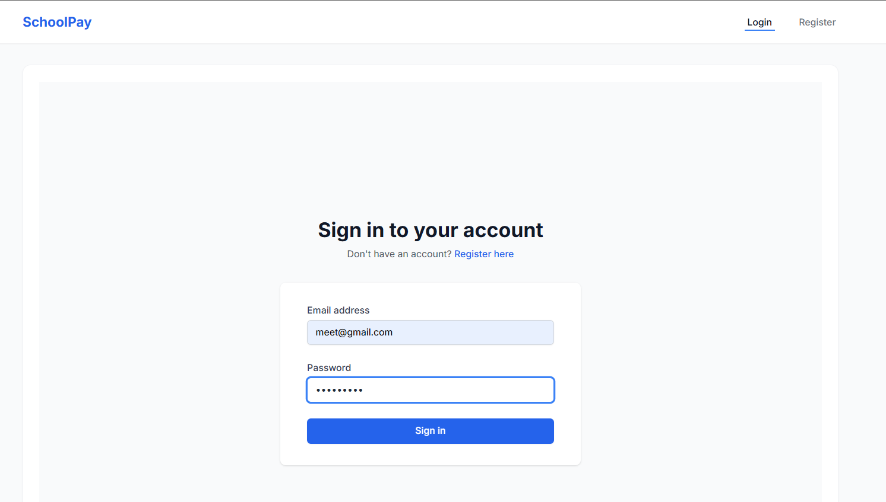
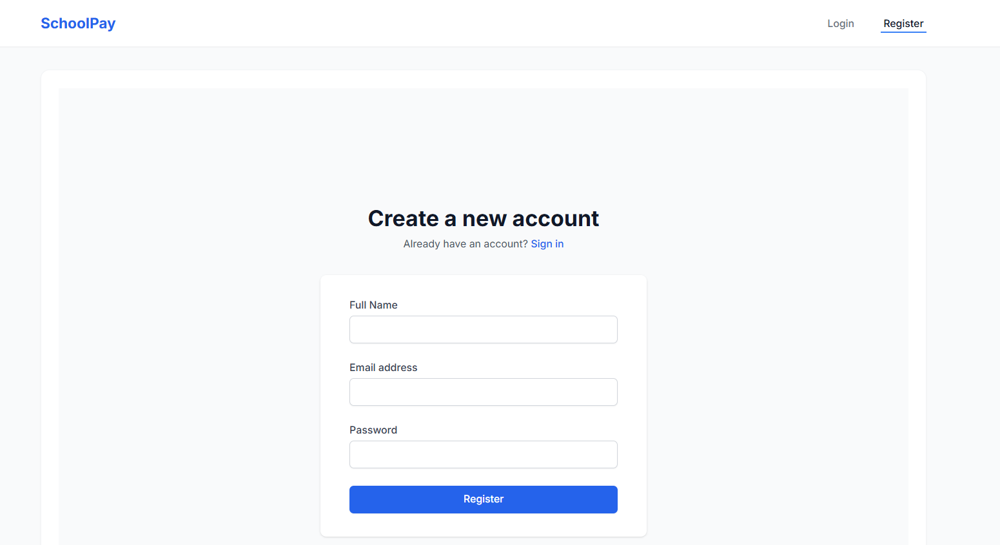
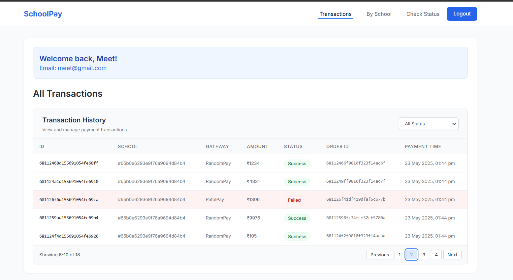
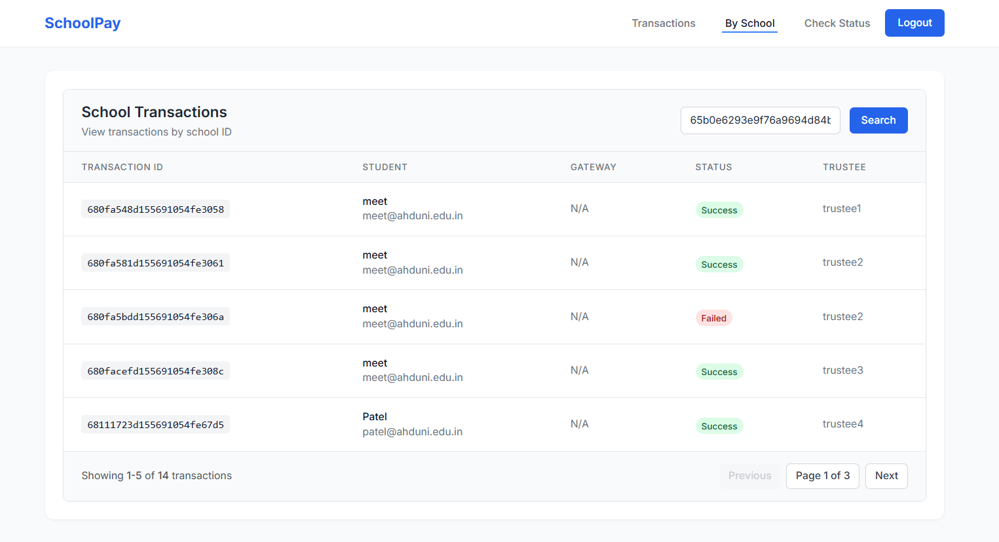
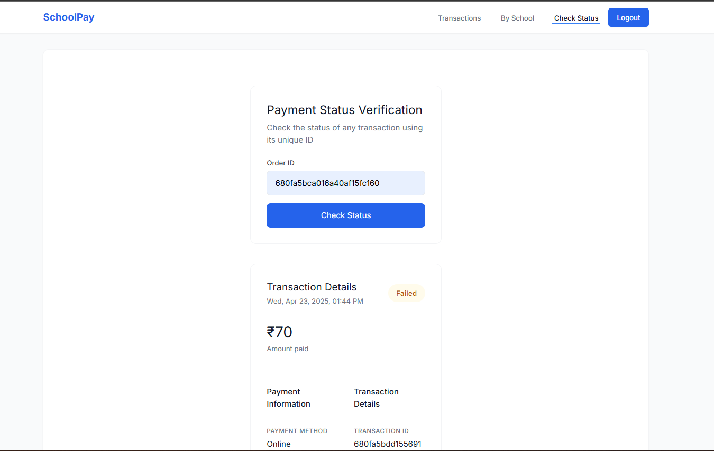

# School Payment Dashboard - Frontend

A modern React-based frontend application for managing school payments and transactions, built with React, TailwindCSS, and Vite.

## Features

- User Authentication (Login/Register)
- Real-time Transaction Management with Socket.IO
- Transaction Status Checking
- Responsive Design
- Modern UI/UX

## Prerequisites

- Node.js (v14 or higher)
- npm or yarn
- Backend API running (see backend README)

## Installation

```bash
# Clone the repository
git clone https://github.com/Meet1306/School-Payment-Dashboard.git

# Navigate to frontend directory
cd Frontend

# Install dependencies
npm install

# Start the development server
npm run dev
```

## Environment Setup

Create a `.env` file in the frontend root directory:

```env
VITE_API_URL=backend_url
```

## Pages & Features

### 1. Authentication Pages

#### Login Page

- Email/Password authentication
- JWT token management
- Error handling
- Loading state indicators



#### Register Page

- New user registration with name, email, and password
- Form validation
- Loading state indicators



### 2. Transaction Management Pages

#### All Transactions Page

- Transaction overview with pagination
- Status filtering (Success, Failed, Pending)
- Real-time transaction updates via Socket.IO
- Transaction details with status badges
- Transaction timestamps
- Amount display with settlement information



#### School Transactions Page

- Displays transactions related to a specific school
- Input field for entering school ID
- Filters transactions based on the provided school ID
- Shows transaction details and status



#### Check Status Page

- Transaction status verification by ID
- Detailed transaction information display
- Payment method and gateway details
- Error handling for invalid IDs



## UI Components

### Common Components

- Navigation Bar with user authentication status
- Transaction Table with pagination and filtering
- Status Badges (Success, Failed, Pending)
- Loading Spinners
- Error Messages
- Success Notifications
- Protected Routes for authenticated users

## Security Features

- JWT Authentication
- Protected Routes
- Secure API Calls
- Input Validation

## Tech Stack

- React.js
- Vite
- TailwindCSS
- Axios
- React Router
- Context API
- Socket.IO Client

## License

This project is licensed under the MIT License.
